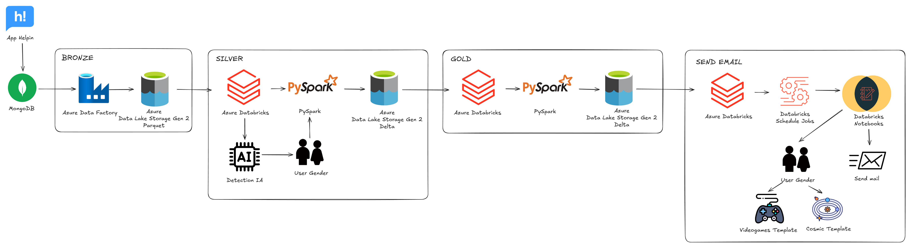
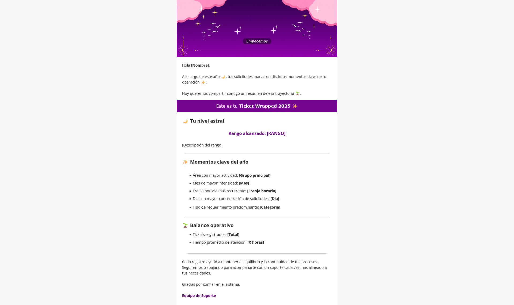
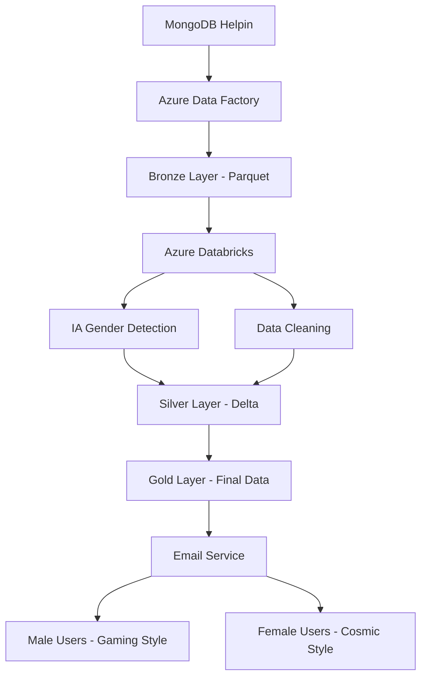

# Wrapped Helpin 2025



Proyecto de personalización de resúmenes anuales para usuarios de Helpin, implementando una experiencia diferenciada según el género del usuario mediante estilos visuales únicos.

## 📋 Descripción del Proyecto

**Wrapped 2025** es una iniciativa innovadora para enviar resúmenes personalizados de los tickets registrados por los usuarios de Helpin durante el año. El proyecto implementa dos experiencias visuales distintas:

- 👨 **Estilo Videojuego**: Diseñado específicamente para usuarios masculinos
  
  
- 👩 **Estilo Cósmico/Astronómico**: Creado para usuarias femeninas
  

El objetivo es proporcionar una experiencia agradable y personalizada que se alinee con las preferencias visuales de cada segmento de usuarios.

## 🏗️ Arquitectura del Sistema

### Arquitectura Medallion Implementada

El proyecto sigue la arquitectura Medallion para el procesamiento de datos:

```
MongoDB (Helpin) → Azure Data Factory → Azure Data Lake Storage
                                    ↓
                            Bronze Layer (Raw Data)
                                    ↓
                          Azure Databricks + PySpark
                                    ↓
                            Silver Layer (Cleaned Data)
                                    ↓
                            Gold Layer (Final Data)
```

### Componentes de la Arquitectura

#### 🔄 **Flujo de Datos**

1. **Extracción**: Azure Data Factory transfiere datos desde MongoDB
2. **Almacenamiento Bronze**: Datos crudos en formato Parquet en Azure Data Lake Storage
3. **Procesamiento Silver**: Limpieza y enriquecimiento con Azure Databricks y PySpark
4. **Inteligencia Artificial**: Identificación de género mediante IA de Azure Databricks
5. **Almacenamiento Gold**: Datos finales optimizados para envío de correos

#### 🛠️ **Tecnologías Utilizadas**

- **Base de Datos Origen**: MongoDB (Helpin)
- **Frontend Helpin**: ExpressJS y Handlebars
- **Backend Helpin**: ExpressJS y Mongoose
- **Orquestación**: Azure Data Factory
- **Almacenamiento**: Azure Data Lake Storage
- **Procesamiento**: Azure Databricks con PySpark
- **Formato de Datos**: Parquet (Bronze), Delta (Silver/Gold)
- **Inteligencia Artificial**: Azure Databricks AI Services

## 📊 Proceso de ETL

### 1. Capa Bronze - Ingesta de Datos Crudos

```python
# Proceso de transferencia vía Azure Data Factory
MongoDB → Parquet Files → ADLS Bronze Layer
```

- Transferencia completa de datos desde MongoDB
- Mantenimiento de estructura original
- Almacenamiento en formato Parquet para optimización

### 2. Capa Silver - Limpieza y Enriquecimiento

```python
# Procesamiento con PySpark en Azure Databricks
- Eliminación de duplicados
- Limpieza de datos inconsistentes
- Enriquecimiento con identificación de género mediante IA
- Almacenamiento en formato Delta
```

### 3. Capa Gold - Datos para Producción

```python
# Datos optimizados para envío de correos
- Información estructurada para plantillas
- Segmentación por género
- Métricas y estadísticas procesadas
```

## 🎯 Características Principales

### ✨ **Personalización por Género**

- **Detección Automática**: IA identifica el género del usuario
- **Diseños Diferenciados**: Dos plantillas visuales únicas
- **Experiencia Optimizada**: Contenido adaptado a preferencias

### 📧 **Sistema de Envío de Correos**

- **Automatización**: Proceso automatizado de envío masivo
- **Plantillas Dinámicas**: Contenido personalizado por usuario
- **Segmentación Inteligente**: Distribución según género detectado

### 🔍 **Análisis de Datos**

- **Estadísticas Anuales**: Resumen completo de actividad del usuario
- **Métricas Relevantes**: Tickets registrados, categorías, tipos
- **Visualizaciones**: Gráficos y elementos interactivos

## 🚀 Implementación

### Configuración del Entorno

1. **Azure Data Factory**
   - Configuración de pipelines de extracción
   - Conexión con MongoDB
   - Transferencia a Azure Data Lake Storage

2. **Azure Databricks**
   - Notebooks de PySpark para procesamiento
   - Configuración de servicios de IA
   - Optimización de rendimiento

3. **Azure Data Lake Storage**
   - Estructura de carpetas Medallion
   - Configuración de permisos
   - Gestión de ciclo de vida de datos

### Flujo de Procesamiento



## 📈 Métricas y Resultados

### KPIs del Proyecto

- **Volumen de Datos Procesados**: [Número de tickets]
- **Tasa de Detección de Género**: [Porcentaje de precisión]
- **Entregas Exitosas**: [Tasa de envío completado]
- **Engagement de Usuarios**: [Interacción con correos]

### Beneficios Alcanzados

- ✅ Personalización mejorada de experiencia de usuario
- ✅ Automatización completa del proceso de envío
- ✅ Escalabilidad para futuras ediciones
- ✅ Insights valiosos sobre comportamiento de usuarios

## 🔧 Requisitos Técnicos

### Infraestructura Requerida

- **Azure Subscription**: Acceso a servicios Azure
- **Azure Data Factory**: Para orquestación de ETL
- **Azure Databricks**: Para procesamiento de datos
- **Azure Data Lake Storage**: Para almacenamiento de datos
- **MongoDB**: Base de datos origen de Helpin

### Dependencias Principales

```python
# PySpark dependencies
pyspark>=3.0.0
delta-spark>=2.0.0

# Azure dependencies
azure-storage-blob>=12.0.0
azure-identity>=1.0.0
```

## 📝 Estructura del Proyecto

```
WrappedHelpin2025/
├── README.md                 # Documentación del proyecto
├── LICENSE                   # Licencia del proyecto
├── assets/                   # Recursos visuales y plantillas
│   ├── templates/            # Plantillas de correo
│   │   ├── gaming/           # Estilo videojuego
│   │   └── cosmic/           # Estilo cósmico
│   └── images/               # Imágenes y gráficos
├── notebooks/                # Notebooks de Databricks
│   ├── bronze_processing/    # Procesamiento capa bronze
│   ├── silver_processing/    # Procesamiento capa silver
│   └── gold_processing/      # Procesamiento capa gold
├── pipelines/                # Configuración de ADF
└── scripts/                  # Scripts de automatización
```

## 🚀 Próximos Pasos

### Mejoras Planeadas

- [ ] Implementación de más estilos visuales
- [ ] Integración con más fuentes de datos
- [ ] Optimización de algoritmos de IA
- [ ] Sistema de feedback de usuarios

### Escalabilidad

- [ ] Multi-región deployment
- [ ] Real-time processing capabilities
- [ ] Advanced analytics integration
- [ ] Mobile app integration

## 📞 Contacto

Para más información sobre el proyecto Wrapped Helpin 2025, contacta al equipo de desarrollo.

### 🔗 **Enlaces de Interés**

- **Helpin**: [https://hdgrupotawa.com/](https://hdgrupotawa.com/)

### 👥 **Autores del Proyecto**

- **Richard Brandon Ramos Vilcapoma** - [GitHub](https://github.com/brandonramosv)
  - *Ingeniero de Datos, Ingeniero de IA, Desarrollo de código y Análisis de datos*
  
- **Benji Ramos Vilcapoma** - [GitHub](https://github.com/benramosv)
  - *Ingeniero de Datos, Ingeniero de IA, Desarrollo de código y Análisis de datos*
  
- **Alexandra Camus Vilcapoma** - [GitHub](https://github.com/alexandracamuscreative-bit)
  - *Diseño de plantillas de correos y experiencia visual*

---

**Helpin** - *Gestión Inteligente de Tickets*
